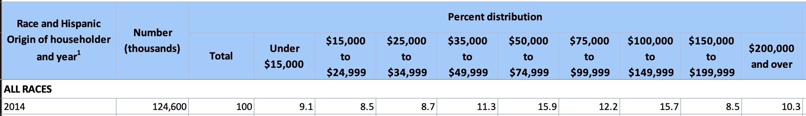
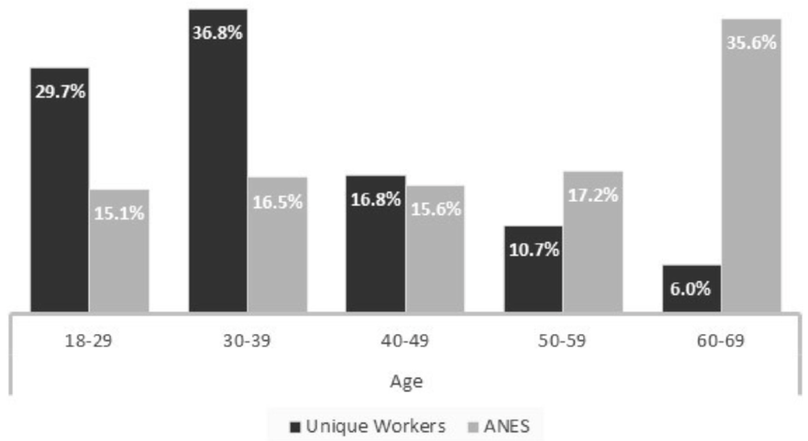

```{r setup, include=FALSE}
knitr::opts_chunk$set(echo = FALSE, results = "markup", fig.width=8, fig.height=4)
options(scipen = 0, digits = 3)  # controls base R output
# check if you have ISLR package, if not, install it
if(!require('pacman')) {install.packages('pacman')}
pacman::p_load(ISLR, readxl, tidyverse, magrittr, dplyr, ggplot2)

library(readr)
library(dplyr)
```


\pagebreak

##  Instructions

- **Submit the following files, one submission for each group:**  (1) Rmd file, (2) a compiled  HTML or pdf version, and (3) all necessary data files if different from our source data. You may directly edit this .rmd file to add your answers. If you intend to work on the problems separately within your group, compile your answers into one Rmd file before submitting. We encourage that you at least attempt each problem by yourself before working with your teammates. Additionally, ensure that you can 'knit' or compile your Rmd file. It is also likely that you need to configure Rstudio to properly convert files to PDF. [**These instructions**](http://kbroman.org/knitr_knutshell/pages/latex.html#converting-knitrlatex-to-pdf) might be helpful.

- In general, be as concise as possible while giving a fully complete answer to each question. All necessary datasets are available in this homework folder on Canvas. Make sure to document your code with comments (written on separate lines in a code chunk using a hashtag `#` before the comment) so the teaching fellows can follow along. R Markdown is particularly useful because it follows a 'stream of consciousness' approach: as you write code in a code chunk, make sure to explain what you are doing outside of the chunk. 

# Case study 1: Audience Size

**Background:** Have you ever listened to [SiriusXM](https://www.siriusxm.com/)? Do you know there was a **Talk Show** run by Wharton professors in Sirius Radio?  Wharton launched a talk show called **Business Radio Powered by the Wharton School** through the Sirius Radio station in January of 2014. Within a short period of time the general reaction seemed to be overwhelmingly positive. The school would like to **estimate the audience size** in May, 2014. There were 51.6 million Sirius Radio listeners then. One approach is to estimate the proportion of the Wharton listeners to that of the Sirius listeners, $p$, so that we will come up with an audience size estimate of approximately 51.6 million times $p$. 

To do so, we launched a survey via Amazon Mechanical Turk ([MTurk](https://www.mturk.com/)) on May 24, 2014 at an offered price of \$0.10 for each answered survey.  We set it to be run for 6 days with a target maximum sample size of 2000 as our goal. Most of the observations came in within the first two days. The main questions of interest are "Have you ever listened to Sirius Radio" and "Have you ever listened to Sirius Business Radio by Wharton?" A few demographic features used as control variables were also collected; these include Gender, Age and Household Income.  

We requested that only people in United States answer the questions. Each person can only fill in the questionnaire once to avoid duplicates. Aside from these restrictions, we opened the survey to everyone in MTurk with a hope that the sample would be more randomly chosen. 

## Data preparation
```{r}
# Reading in the csv file.
survey <- suppressWarnings(
          readr::read_csv("data/Survey_results_final.csv", col_types = readr::cols(.default = readr::col_character()), show_col_types = FALSE))

# Selecting columns
survey <- survey %>%
  select(`Answer.Age`, `Answer.Gender`, `Answer.Education`, `Answer.HouseHoldIncome`, `Answer.Sirius Radio`, `Answer.Wharton Radio`, WorkTimeInSeconds)

# Renaming columns
survey <- survey %>%
  rename(age = `Answer.Age`, gender = `Answer.Gender`, education = `Answer.Education`, 
         income = `Answer.HouseHoldIncome`, sirius = `Answer.Sirius Radio`, 
         wharton  = `Answer.Wharton Radio`, worktime = WorkTimeInSeconds)

```

### Handling missing/wrongly filled values of the selected variables

```{r}
# Finding missing values.
colSums(is.na(survey))
survey %>% filter(if_any(everything(), is.na))
survey %>% filter(trimws(tolower(education)) == "select one")

# Removing no age entry.
survey <- survey %>% filter(!is.na(age))

# Changing "select one" entries to "Other"
survey <- survey %>% mutate(education = if_else(tolower(trimws(education)) == "select one", "Other", education))

# Setting NA entries of sirius and wharton to no.
survey <- survey %>%
  mutate(
    sirius  = if_else(is.na(sirius), "No", sirius),
    wharton = if_else(is.na(wharton), "No", wharton)
  )

colSums(is.na(survey))
```

The first table shows entries that have an NA value and the second table shows entries which have "select one" as the education type.


It is evident that there are a mix of different attributes which are missing. 


1. Age: There is one entry with no age. That row will be invalidated, as all people have ages. 

2. Gender: There are a couple entries with no gender. Looking at the data manually, the only other genders are Male and Female. People may identify with different genders, explaining the NA entries.

3. Education: No entries are NA, however there were 19 entries that had "select one". These entries have been renamed to "Other".

4. Income: NA income entries are be interpreted as the survey participant being unemployed.

5. Sirius / Wharton: NA entries will be treated as false.


## Brief summary 

We will first observe the level of education and income for the survey participants.
```{r}
# Count of the number of people by education level.
survey %>%
  count(education) %>%
  ggplot(aes(x = education, y = n, fill = education)) +
  geom_col() +
  theme(axis.text.x = element_text(angle = 60, hjust = 1)) +
  guides(fill = "none")

# Count of the number of people by income.
survey %>%
  count(income) %>%
  ggplot(aes(x = income, y = n, fill = income)) +
  geom_col() +
  theme(axis.text.x = element_text(angle = 60, hjust = 1)) +
  guides(fill = "none")
```

The majority of survey takers (744 people) have some college experience, or an Associate's degree. The second most common education level is a Bachelors / Other 4 Year degree, with 614 entries. 

Most survey takers (429) had an income in the range of $30,000 - $50,000. The bulk of the participants have incomes within $15,000 - $75,000, with very few outside of that range (<$15k, 208), (>$150k, 47). Even though high-income respondents are rare, they are disproportionately more likely to listen to Wharton Radio.

### Listen Rate vs Age

```{r}
survey <- survey %>%
  mutate(
    age_num = suppressWarnings(as.numeric(trimws(age)))
  )

# Plot of the Wharton listen rate as a function of age.
survey <- survey %>%
          mutate(age_bin = cut(age_num, breaks = seq(18, 80, 10), right = FALSE, include.lowest = TRUE))

survey %>% 
      filter(!is.na(age_bin)) %>%
      count(age_bin, wharton) %>%
      group_by(age_bin) %>%
      mutate(rate = n / sum(n)) %>%
      filter(wharton == "Yes") %>%
      ggplot(aes(x = age_bin, y = rate, group = 1)) +
      geom_point() +
      geom_line() +
      labs(title = "Wharton Listen Rate vs Age", x = "Age (binned)", y = "Wharton listen rate")

# Plot of the Sirius listen rate as a function of age. 
survey %>%
      filter(!is.na(age_bin)) %>%
      count(age_bin, sirius) %>%
      group_by(age_bin) %>%
      mutate(rate = n / sum(n)) %>%
      filter(sirius == "Yes") %>%
      ggplot(aes(x = age_bin, y = rate, group = 1)) +
      geom_point() +
      geom_line() +
      labs(title = "Sirius Listen Rate vs Age", x = "Age (binned)", y = "Sirius listen rate")
```

The listening rate of the two radio stations as a function of age was graphed. The listening rates on average were substantially lower for Wharton compared to Sirius. Additionally, there were no survey takers in the age range of 58-68 who listened to the Wharton talk show. 

There was a significant rise in listening rates for participants ages 68-78 for the Wharton talk show compared to younger participants. The overall trend for the Wharton talk show suggests an increase in listen rate as age increases. The sirius listen rate has the opposite relationship, with the listening rate peaking for ages 28-38 with a listening rate of almost 82.5%, before dropping by a substantial amount as age increases, down to around a 57% listen rate for ages 58-68, before increasing marginally to 60% for ages 68-78.


### Listen Rate vs Income

```{r}
survey <- survey %>%
  mutate(
    income = if_else(is.na(income), "NA", income)
  )

income_order <- c(
  "NA",
  "Less than $15,000",
  "$15,000 - $30,000",
  "$30,000 - $50,000",
  "$50,000 - $75,000",
  "$75,000 - $150,000",
  "Above $150,000"
)

survey <- survey %>%
  mutate(
    income = factor(income, levels = income_order, ordered = TRUE)
  )

survey %>%
  count(income, wharton) %>%
  group_by(income) %>%
  mutate(rate = n / sum(n)) %>%
  filter(wharton == "Yes") %>%
  ggplot(aes(x = income, y = rate, group = 1)) +
  geom_point() +
  geom_line() +
  theme(axis.text.x = element_text(angle = 60, hjust = 1)) +
  labs(title = "Wharton Listen Rate vs Income", y = "Wharton listen rate")

survey %>%
  count(income, sirius) %>%
  group_by(income) %>%
  mutate(rate = n / sum(n)) %>%
  filter(sirius == "Yes") %>%
  ggplot(aes(x = income, y = rate, group = 1)) +
  geom_point() +
  geom_line() +
  theme(axis.text.x = element_text(angle = 60, hjust = 1)) +
  labs(title = "Sirius Listen Rate vs Income", y = "Sirius listen rate")

```

Plotting the listen rate as a function of income shows additional insights. For the Wharton talk show, we can see that as income increases, the listen rate increases as well. Participants with income below $50,000 all have similar listening rates, around 3-3.5%. 

Sirius listening rates show a more consistent rise as income increases, however at the high income levels (>$150,000), the listening rates drop by around 10%, a significant margin. 

### Addressing Why Individuals Take Survey Despite Low Compensation

When observing the sample data, we can see that there was a variety of income levels listed despite the monetary compensation for the survey being on 10 cents. Despite this small compensation, a number of respondents report relatively high household incomes. This does not necessarily imply that these individuals rely on these surveys as a primary source of income, but they may rather complete them out of curiosity, habit, or leisure, when the opportunity cost of a short task is negligible. Additionally, reported household income may reflect shared income within a household rather than the respondent’s personal earnings. 


## Sample properties

The population from which the sample is drawn determines where the results of our analysis can be applied or generalized. We include some basic demographic information for the purpose of identifying sample bias, if any exists. Combine our data and the general population distribution in age, gender and income to try to characterize our sample on hand.

1. Does this sample appear to be a random sample from the general population of the USA? Why it is crucial to have randomness here?

```{r}
total <- nrow(survey)

survey %>% count(income) %>% mutate(percent = 100 * n / sum(n))
survey %>% count(gender) %>% mutate(percent = 100 * n / sum(n))

survey <- survey %>%
  mutate(
    age_num = suppressWarnings(as.numeric(trimws(age)))
  )

survey <- survey %>%
  mutate(
    age_bin = cut(
      age_num,
      breaks = seq(18, 80, 10),
      right = FALSE,
      include.lowest = TRUE
    )
  )

survey %>%
  filter(!is.na(age_bin)) %>%
  count(age_bin) %>%
  mutate(
    percent = 100 * n / sum(n)
  )

```

We will cover the distribution of income first.



Comparing the percentage distributions of income, we observe the following:

1. Income levels up to \$75,000 are over-represented:
   - Under \$15,000: 11.8\% vs 9.1\% (U.S. population)
   - \$15,000--\$50,000: 45.176\% vs 28.5\% (U.S. population)
   - \$50,000--\$75,000: 21.396\% vs 15.9\% (U.S. population)

2. Income levels above \$75,000 are under-represented:
   - \$75,000--\$150,000: 18.672\% vs 27.9\% (U.S. population)
   - Above \$150,000: 2.667\% vs 18.8\% (U.S. population)

Overall, higher-income households are substantially under-represented in the survey sample, while lower-income households (below \$75,000) are over-represented relative to the U.S. population.

Now analyzing gender, there were 744 Females and 1012 Males. Males represent 57.435% of the survey population, which is a slight over-representation compared to the US average of 51%.

The younger generation is over-represented, while the older generation is under-represented. This is likely attributed to the familiarity of technology to different age groups.

1. Individuals aged between 18-38 are over-represented.
   - 18--28: 48.719% vs 13.5% (reality)
   - 28--38: 32.285% vs 14.1% (reality)
2. Individuals aged between 38-78 are under-represented.
   - 38--48: 10.586% vs 13.1% (reality)
   - 48--58: 5.919% vs 12.2% (reality)
   - 58--68: 2.106% vs 12.1% (reality)
   - 68--78: 0.285% vs 9.2% (reality)
(Data was taken from US census data, 2014)

Hence, it is evident that we have a slightly skewed sample of the US population, which may not accurately represent the true listening rates of the radios.


2. Does this sample appear to be a random sample from the MTURK population?

Analysing income distribution of MTurk Users:


The survey data represents the middle income range fairly well, however it over-represents lower income levels and under-represents higher income levels. 

**Under \$30k**: 31.8% vs 24.58% (MTurk) - Over-represented

**\$30k - \$50k**: 24.3% vs 21.02% (MTurk) - Slightly over-represented

**\$50k - $150k**: 40.1% vs 48.65 (MTurk) - Under-represented

**Above \$150k**: 2.67% vs 4.92% (MTurk) - Slightly under-represented.



The survey data broadly reflects the age structure of the MTurk population, but it substantially over-represents younger respondents and under-represents older respondents.

- **Ages 18–29:**  
  48.7% (survey) vs 29.7% (MTurk) — **Highly over-represented**

- **Ages 30–39:**  
  32.4% (survey) vs 36.8% (MTurk) — **Slightly under-represented**

- **Ages 40–49:**  
  10.6% (survey) vs 16.8% (MTurk) — **Under-represented**

- **Ages 50–59:**  
  5.9% (survey) vs 10.7% (MTurk) — **Under-represented**

- **Ages 60 and above:**  
  2.4% (survey) vs approximately 16.7% (MTurk) — **Highly under-represented**

Overall, the survey sample is noticeably younger than the MTurk population. Nearly half of respondents fall in the youngest age group, while older age groups—particularly those above age 60 are under represented. This suggests that, although the sample is drawn from MTurk, age-related selection effects may influence the estimated listening behavior.


## Final estimate

Provide an approximate **95\% confidence interval** of the Wharton audience size by May of 2014. Assume that the sample is a random sample of the MTURK population, and that the proportion of Wharton listeners vs. Sirius listeners in the general population is the same as that in the MTURK population. Write a brief executive summary to summarize your findings and how you came to that conclusion.


1. Goal of the study

The goal of this study was to estimate the audience size of Business Radio Powered by the Wharton School in May 2014, based on survey data collected from U.S. based respondents.

2. Method used: data gathering, estimation methods

```{r}
# Restricting sample to sirius listeners.
sirius_sample <- survey %>% filter(sirius == "Yes")

n <- nrow(sirius_sample)
x <- sum(sirius_sample$wharton == "Yes")

p_hat <- x / n

# Estimating the proportion of wharton listeners to sirius
p_hat

# Computing standard deviation
sd <- sqrt(p_hat * (1 - p_hat) / n)

# Using empirical rule to derive 95% confidence interval.
ci_p <- c(
  p_hat - 1.96 * sd,
  p_hat + 1.96 * sd
)

ci_p

# Scaling to true audience size.
audience_ci <- 51.6e6 * ci_p
audience_est <- 51.6e6 * p_hat

audience_ci
audience_est
```
3. Findings

Wharton listeners represent about 5% of the MTurk Population. The estimated Wharton Business Radio audience size is approximately 2.6 million listeners, with a 95% confidence interval ranging from 2.0 million to 3.2 million listeners.


4. Limitations of the study. 

This estimate relies on the assumption that the Mechanical Turk sample is representative of the Sirius listener population with respect to Wharton listening behavior. However, earlier analyses show that the sample differs from the general U.S. population in age, income, and gender, and MTurk workers may exhibit systematic differences in media consumption. As a result, while the confidence interval captures some of the sampling variability, it does not account for potential selection bias, population distribution and hence, the true audience size may lie outside the reported range.


## New task

Now suppose you are asked to design a study to estimate the audience size of Wharton Business Radio Show as of today: You are given a budget of $1000. You need to present your findings in two months. 

Write a proposal for this study which includes:

1. Method proposed to estimate the audience size.
2. What data should be collected and where it should be sourced from. (Can we use ChatGPT to get us a rough estimate?)

Please fill in the google form to list your platform where surveys will be launched and collected [HERE](https://forms.gle/8SmjFQ1tpqr6c4sa8) 


A good proposal will give an accurate estimation with the least amount of money used. 


# Case study 2: Women in Science

Are women underrepresented in science in general? How does gender relate to the type of educational degree pursued? Does the number of higher degrees increase over the years? In an attempt to answer these questions, we assembled a data set (`WomenData_06_16.xlsx`) from [NSF](https://ncses.nsf.gov/pubs/nsf19304/digest/field-of-degree-women) about various degrees granted in the U.S. from 2006 to 2016. It contains the following variables: Field (Non-science-engineering (`Non-S&E`) and sciences (`Computer sciences`, `Mathematics and statistics`, etc.)), Degree (`BS`, `MS`, `PhD`), Sex (`M`, `F`), Number of degrees granted, and Year.

Our goal is to answer the above questions only through EDA (Exploratory Data Analyses) without formal testing. We have provided sample R-codes in the appendix to help you if needed. 

## Data preparation  

### Understand and clean the data

Notice the data came in as an Excel file. We need to use the package `readxl` and the function `read_excel()` to read the data `WomenData_06_16.xlsx` into R. 

#### Read the data into R.

```{r}
women_data <- read_excel("data/WomenData_06_16.xlsx")
w_data <- women_data
```

#### Clean the names of each variables. (Change variable names to  `Field`,`Degree`, `Sex`, `Year` and `Number` )

```{r}
colnames(w_data)
w_data <- w_data %>%
  rename(`Field` = `Field and sex`,
         `Number` = `Degrees Awarded`)
colnames(w_data)
```

#### Set the variable natures properly. 

```{r}
w_data <- w_data %>%
  mutate( Field = as.factor(Field),
          Degree = as.factor(Degree),
          Sex = as.factor(Sex)
          )
summary(w_data)
```

#### Any missing values?

```{r}
colSums(is.na(w_data))
```

### Write a summary describing the data set provided here. 

#### How many fields are there in this data?

```{r}
dim(w_data)
```

There are 5 different variables (Field, Degree, Sex, Year and Number), and 660 data entries in the data set.

#### What are the degree types?

```{r}
unique(w_data$Field)
```
There are 10 degree types: Agricultural Sciences; Biological Sciences; Computer Sciences; Earth, Atmospheric, and Ocean Sciences; Mathematics and Statistics; Physical Sciences; Psychology; Social Sciences; Engineering; and Non-S&E.

#### How many year's statistics are being reported here? 

```{r}
length(unique(w_data$Field))
```

10 years of statistic are being reports (2006 - 2016).

## BS degrees in 2015

### Is there evidence that more males are in science-related fields vs `Non-S&E`? Provide summary statistics and a plot which shows the number of people by gender and by field. Write a brief summary to describe your findings.

The number of males and females in S&E were relatively similar in 2015 with 327,122 and 322,935 people graduating respectively. This is visualised in the Bar Chart where the bars for Male and Female S&E Graduates is essentially the same. Furthermore, this shows that there are many more gradutes in non-S&E courses compared with S&E courses. However, this could be attributed to a limited range of degrees available in S&E courses compared with non-S&E courses.

```{r}
w_data %>%
  filter(Year == 2015, Degree == "BS") %>%
  mutate(SE = ifelse(Field!="Non-S&E" , "S&E", "Non-S&E")) %>%
  group_by(SE, Sex) %>%
  summarise(SE_number = sum(Number), .groups = "drop") %>%
  ggplot(aes(x = SE, y = SE_number, fill = Sex)) +
  geom_col(position = "dodge") +
  theme(axis.text.y = element_text(angle = 60)) +
  labs(
      title = "Number of Bachelor Graduates by Gender, Degree Type and Field (2015)",
      x = "Field",
      y = "Number of Graduates",
      fill = "Gender"
    )
```

```{r include=TRUE, results='asis', echo=FALSE}
tab <- w_data %>%
  filter(Year == 2015, Degree == "BS") %>%
  mutate(SE = ifelse(Field!="Non-S&E" , "S&E", "Non-S&E")) %>%
  group_by(SE, Sex) %>%
  summarise(Total = sum(Number),
            .groups = "drop")

knitr::kable(tab, digits = 2, caption = "Summary statistics by S&E group and gender in 2015")
```

## EDA bringing type of degree, field and gender in 2015

### Describe the number of people by type of degree, field, and gender. Do you see any evidence of gender effects over different types of degrees? Again, provide graphs to summarize your findings.

The number of people pursuing courses in Bachelors and Masters degrees in 2015 is very unequal with around 1,500,000 and 700,000 graduating in Mathematics and Statistics respectively, compared with all of the other courses where graduates numbered less than around 200,000. This pattern is evident in PhD courses to a less extent, with around 30,000 people graduating in Mathematics and Statistics compared with less than 10,000 for the other subject areas.

Females make up a larger proportion of graduates in Mathematics and Statistics as well as Physical Sciences across all three degree types. Conversely, Males comprise the most graduates in the subject area  Earth, Atmospheric and Ocean Sciences, with the remaining topics being relatively equally weighted in relation to gender.

```{r}
w_data %>%
  filter(Year == 2015, Degree == "BS") %>%
  ggplot(aes(x = Field, y = Number, fill = Sex)) +
  geom_col(position = "dodge") +
  labs(
    title = "Number of Bachelor Graduates by Gender and Field (2015)",
    x = "Field",
    y = "Number of Graduates",
    fill = "Gender"
  ) + 
  theme(axis.text.x = element_text(angle = 45, vjust = 0.5))
```
```{r}
w_data %>%
  filter(Year == 2015, Degree == "MS") %>%
  ggplot(aes(x = Field, y = Number, fill = Sex)) +
  geom_col(position = "dodge") +
  labs(
    title = "Number of Masters Graduates by Gender and Field (2015)",
    x = "Field",
    y = "Number of Graduates",
    fill = "Gender"
  ) + 
  theme(axis.text.x = element_text(angle = 45, vjust = 0.5))
```

```{r}
w_data %>%
  filter(Year == 2015, Degree == "PhD") %>%
  ggplot(aes(x = Field, y = Number, fill = Sex)) +
  geom_col(position = "dodge") +
  labs(
    title = "Number of PhD Graduates by Gender and Field (2015)",
    x = "Field",
    y = "Number of Graduates",
    fill = "Gender"
  ) + 
  theme(axis.text.x = element_text(angle = 45, vjust = 0.5))
```

## EDA bring all variables 

### In this last portion of the EDA, we ask you to provide evidence numerically and graphically: Do the number of  degrees change by gender, field, and time? 

Overtime, females have consistently had more graduates in subject areas including Agricultural Sciences, Biological Sciences, Non-S&E, Psychology and Social Sciences. This differs to Computer Science, Earth, Atmospheric and Ocean Sciences, Engineering, Mathematics and Statistics and Physical Sciences which have consistently more male graduates each year.

All subject areas have experienced strong growth in graduate numbers, however, Earth, Atmospheric and Ocean Sciences, and Social Sciences have experienced slower growth in the past three years, with Social Sciences even falling in popularity.

Finally, Agricultural Sciences and Earth, Atmospheric and Ocean Sciences initially had relatively equal numbers of male and femal graduates in 2006, however, both have diverged significantly over the 10 years. This has resulted in females studying Agricultural Sciences more and males studying Earth, Atmospheric and Ocean Sciences more.

```{r}
w_data %>%
  group_by(Year, Field, Sex) %>%
  summarise(total_degrees = sum(Number), .groups = "drop") %>%
  ggplot(aes(x = Year, y = total_degrees, color = Sex)) +
  geom_line() +
  facet_wrap(~ Field, scales = "free_y") +
  labs(
    title = "Degrees Over Time by Gender and Field Group",
    x = "Year",
    y = "Number of Degrees",
    color = "Gender"
  ) +
  theme(axis.text.x = element_text(angle = 90, vjust = 0.5))
```


## Women in Data Science

### Finally, is there evidence showing that women are underrepresented in data science? Data science is an interdisciplinary field of computer science, math, and statistics. You may include year and/or degree.

Yes, females have been underrepresented in data science consistently across the decade. Whilst the total number of females studying this subject area have increased from 10,000 to 12,000, they are still significantly less than the current 53,000 males gradutates, and have experienced much slower growth in popularity compared with the 15,000 increase in males.

```{r}
w_data %>%
  filter(Field %in% c("Computer sciences", "Mathematics and statistics")) %>%
  ggplot(aes(x = Year, y = Number, fill = Sex)) +
  geom_col(position = "dodge") +
  labs(
    title = "Number of Graduates by Gender in Data Science",
    x = "Year",
    y = "Number of Graduates",
    fill = "Gender"
  )
```

## Final brief report

### Summarize your findings focusing on answering the questions regarding if we see consistent patterns that more males pursue science-related fields. Any concerns with the data set? How could we improve on the study?

Over the 10 year study, we consistently see males pursuing science-related fields more than females. Moreover, this gender gap has almost doubled over this time period.

This study raised no issues about the integrity or quality of the data set. An addition could be considering individuals who study majors from different schooles (S&E and non-S&E). The reason for why females are underrepresented may be because they are not having their full degree structure reported in this study (e.g. someone could major in English and Chemistry in an Arts Degree - this would be shown as Non-S&E).

To improve this study this experiment should be repeated numerous times, improving validity and reliability. Furthermore, it should be conducted across multiple universities in the same region, limiting the impact of potential bias from the current test population.

```{r}
  w_data %>%
  mutate(SE = ifelse(Field!="Non-S&E" , "S&E", "Non-S&E")) %>%
  group_by(Year, SE, Sex) %>%
  summarise(SE_number = sum(Number), .groups = "drop") %>%
  ggplot(aes(x = Year, y = SE_number, color = Sex)) +
  geom_line() +
  facet_wrap(~ SE, scales = "free_y") +
  labs(
    title = "Graduates Over Time by Gender: S&E vs Non-S&E",
    x = "Year",
    y = "Number of Graduates",
    color = "Gender"
  )
```


# Case study 3: Major League Baseball

We would like to explore how payroll affects performance among Major League Baseball teams. The data is prepared in two formats record payroll, winning numbers/percentage by team from 1998 to 2014. 

Here are the datasets:

- `MLPayData_Total.csv`: wide format
- `baseball.csv`: long format

Feel free to use either dataset to address the problems. 

## Loading Data
``` {r, echo = TRUE} 
pay_data <- read_csv("data/MLPayData_Total.csv")
team_data <- read_csv("data/Baseball.csv")
```

## EDA: Relationship between payroll changes and performance

Payroll may relate to performance among ML Baseball teams. One possible argument is that what affects this year's performance is not this year's payroll, but the amount that payroll increased from last year. Let us look into this through EDA. 

Create increment in payroll

# 4.1 - Relationship between payroll changes and performance

a). To describe the increment of payroll in each year there are several possible approaches. Take 2013 as an example:

Explain why the log difference is more appropriate in this setup.

In describing the increment of payroll in each year, there are several possible approaches. While one approach is to take the difference in payroll between year $x$ and year $x - 1$, another approach is to take $log(x) - log(x - 1)$. The second approach is objectively better as it calculates the percentage change year on year instead of giving an absolute number change. This helps provide a more informative view towards the scale of the payroll increments year on year. Furthermore, a clean property of using the log measure to calculate percentage changes is that in contrast to the typical approach, it maintains symmetry of percentage changes where the percentage increase from $a$ to $b$ is equal to the percentage decrease from $b$ to $a$. 


b). Create a new variable `diff_log=log(payroll_2013) - log(payroll_2012)`. Hint: use `dplyr::lag()` function.

## Part b)
``` {r, echo = TRUE}
diff_log <- team_data %>%
  filter(year %in% c(2012, 2013)) %>%
  group_by(team) %>%
  arrange(year, .by_group = TRUE) %>%
  mutate(diff_log = log(payroll) - lag(log(payroll)))

head(diff_log)

```

c). Create a long data table including: team, year, diff_log, win_pct

``` {r, echo = TRUE}
team_data <- team_data %>% 
  group_by(team) %>%
  arrange(year, .by_group = TRUE) %>%
  mutate(diff_log = log(payroll) - lag(log(payroll)))

head(team_data)
```


# 4.2 - Exploratory Questions

## Part a) Which five teams had highest increase in their payroll between years 2010 and 2014, inclusive?

``` {r, echo = TRUE}
years_of_interest <- c(2010, 2011, 2012, 2013, 2014)

payroll_increase <- team_data %>%
  filter(year %in% years_of_interest) %>%
  group_by(team) %>%
  arrange(year, .by_group = TRUE) %>%
  mutate(increase = log(payroll) - lag(log(payroll), 4)) %>%
  filter(year == 2014) %>%
  ungroup() %>%
  arrange(desc(increase)) %>%
  slice_head(n = 5)

head(payroll_increase)
```


## Part b) Between 2010 and 2014, inclusive, which team(s) "improved" the most? That is, had the biggest percentage gain in wins?
``` {r, echo = TRUE}
performance_increase <- team_data %>%
  filter(year %in% years_of_interest) %>%
  group_by(team) %>%
  arrange(year, .by_group = TRUE) %>%
  mutate(per_increase = win_pct - lag(win_pct, 4)) %>%
  filter(year == 2014) %>%
  arrange(desc(per_increase)) %>%
  ungroup()

head(performance_increase)
```

# 4.3 Do log increases in payroll imply better performance?

Is there evidence to support the hypothesis that higher increases in payroll on the log scale lead to increased performance?

Pick up a few statistics, accompanied with some data visualization, to support your answer. 

``` {r, echo = TRUE}
performance_to_payroll <- team_data %>%
  group_by(team) %>%
  arrange(year, .by_group = TRUE) %>%
  mutate(pay_delta = log(payroll) - lag(log(payroll))) %>%
  mutate(performance_delta = win_pct - lag(win_pct)) %>%
  drop_na() %>%
  ungroup()

total_performance_to_payroll <- team_data %>%
  group_by(team) %>%
  arrange(year, .by_group = TRUE) %>%
  mutate(pay_delta = log(payroll) - lag(log(payroll), 16)) %>%
  mutate(performance_delta = win_pct - lag(win_pct, 16)) %>%
  drop_na() %>%
  ungroup()
```

``` {r, echo = TRUE}
ggplot(performance_to_payroll, aes(x = pay_delta, y = performance_delta)) +
  geom_point(alpha = 0.6) +
  geom_smooth(method = "lm", se = FALSE) +
  labs(
    x = "Log payroll change (year on year)",
    y = "Win percentage change (year on year)",
    title = "Payroll growth vs team performance"
  )
```
``` {r, echo = TRUE}
ggplot(total_performance_to_payroll, aes(x = pay_delta, y = performance_delta)) +
  geom_point(alpha = 0.6) +
  geom_smooth(method = "lm", se = FALSE) +
  labs(
    x = "Log payroll change",
    y = "Win percentage change",
    title = "Payroll growth vs team performance across total period"
  )
```
``` {r, echo = TRUE}
cor(performance_to_payroll$pay_delta,
    performance_to_payroll$performance_delta)

model <- lm(performance_delta ~ pay_delta,
            data = performance_to_payroll)

summary(model)
```
From the data provided above, we can see that there is very little correlation between log payroll increases and petter team performance. In the graphs, we can observe that while the slope is positive, it is extremely small, indicating a very weak linear relationship. This is further supported by the correlation value of **0.0377** which is close to 0 or no correlation. Furthermore, the low $R^2$ value of **0.00142** indicates that payroll changes explain only 0.14% of the variation in performance changes, meaning that this model has almost no explanatory power. Therefore, we can conclude that log payroll increases do not lead to better team performance.


## Comparison
# 4.4 - Comparison
``` {r, echo = TRUE}

model_one <- lm(win_pct ~ pay_delta,
            data = performance_to_payroll)

model_two <- lm(win_pct ~ log(payroll),
            data = performance_to_payroll)

summary(model_one)
summary(model_two)

```
From the summaries attained above, we can observe that model one (using yearly increases in payroll) has an $R^2$ value of **0.0703** and that model two (using yearly payroll) has an $R^2$ value of 0.0664. As such, we can see that model 1 has more explanatory power given that the model accounts for more of the variance. However, the difference between the two values is very small so while yearly increase in payroll would serve as a slightly better measure, the difference is very small and the two models have similar explanatory power. 

# 4.5 - Going beyond EDA

Going forward, a more reasonable way to study the relationship between payroll and team performance beyond simple plots would be by using linear regression alongside more statistical analysis including the $R^2$ value, model comparisons and slope tests. 

Process: In performing my analysis, GAI, particularly the Chat-GPT model, guided my analysis by suggesting further methods of testing the relationships between the given variables, in particular linear regression and interpreting the $R^2$ value. As such, I incorporated such features into my analysis and drew upon their data in reaching a conclusion for the previous questions. 

These methods are better than the basic EDA methods as it uses formal statistical models rather than just relying on visual patterns. Furthermore, it quantifies relationships using measures such as correlations allowing for direct comparison of measures such as payrolls or increasing payrolls. Furthermore, it reduces the risk of formulating incorrect conclusions because of noisy scatter plots or other visual factors. 

In conclusion, from the above analysis, we can conclude that there is a very weak relationship between payroll and performance. Payroll increases have shown very little correlation with performance increases and regression tests have shown that very little of the variability in performance can be attributed to payroll data. The limitations of this conclusion lie in the simplicity of the model which fails to consider the influence of other factors in determining a relationship between payroll and performance. Furthermore, only a linear model was used and as such, we were unable to test for other types of non-linear relationships.